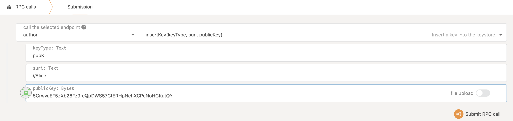
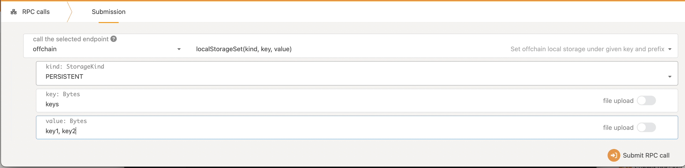

# Solo-chain Devnet 🔌✉️

A solo-chain devnet that will serve as an initial testbed for code processing file metadata. This solo-chain serves to:
1. Retrieve metadata
2. House a client-side module that contains logic to create a hash from the JSON metadata.
3. Send a hash of the data into the runtime via custom runtime api, finalize the expected hash, and store it.

## Upgrades
> ⚠️ **Before making changes**: Be aware of the considerations for upgrading this node. See [runtime-upgrades](docs/runtime-upgrades.md)

## Notable Changes
The node contains several changes outside the runtime worth paying attention to when working with the node.

### Offchain data retrieval within client
The client will depend on some of our own crates, as well as an application-specific one from the team. These crates are(in order of dependency):
- primitives: this crate contains primitive types definitions, as well as some types that are used both in the runtime & in the off-chain plugin
- runtime-api: this crate contains the definitions for the runtime apis used in our app.
- offchain-plugin: The module that performs some example business logic, which in this case hashes some local file.
This module should run some computations in some long-running format. It is also responsible for getting the config and setting the keys.

###  Generic extrinsic calls
One requirement is to allow for calls to any extrinsic to be made from the client-level. We accomplish this by passing the client
to the offchain plugin & creating calls using the runtime apis.

This is implemented through the following currently:
We send a `MapToCall` variant to the runtime using the [`ConstructExtrinsic`](primitives/runtime-api/src/lib.rs) runtime api.
The enum mirrors the Call enum, though is purposefully separate from that enum.
This enum notably grants flexibility, but requires maintenance and also care with upgrades as any changes
to the extrinsics will require a full upgrade to the node.

### Key Management
The node expects some key to be inserted through (Author->insertKey()) RPC call. Without it, some above-mentioned functions will not begin.
RPC calls can be found inside Developer section in the `polkadot.js.org/apps` UI.
<br>
The insertKey() expects three inputs to be provided:
```
1. keyType: name of the key
2. suri: Secret Key URI
3. publicKey: value of the public key
```
Like this:


### Offchain Configuration
The node expects some offchain configurations as well which needs to be inserted through (offchain->localStorageSet) RPC call.
<br>
The localStorageSet() expects three inputs:
```
1. kind: Storage Kind (Always set to Persistent)
2. key: name of the key
3. value: value of the key
```
The order of offchain configuration needs to be set in this order:
```
// "keys" is the name of the key which contains names of all the offchain configuration keys((',' separated key names))
key: keys
value: key1, key2, key3
// then key-value pairs for all the offchain configuration, like this:
key: key1
value: value1

key: key2
value: value2

and so on...
```
Note: You don't need to provide the input in bytes as substrate by default converts your input into bytes.


#### Local Offchain Config Keys required for Logic Provider Operation
The offchain plugin retrieves some offchain data, in the form of a local JSON file.
This part of the module is meant to exemplify the config's use in supplying business logic configuration.
One required value is the location of the local JSON file. This is passed into the config in the
`local_file_path` key. So to run the logic provider node locally, one must set this key. To do so:
1. As part of the necessary offchain config setup, provide the `local_file_path` key (see `Offchain Configuration` above).
2. Now, for the `local_file_path` key, set the value as the path to the local JSON file. Currently: `offchain-plugin/mock/metadatas.json`.


#### Config updates after starting the node

When starting the client module, we also start a process that refetches the config
every set number of seconds. So, whenever you wish to change a file path, or any value
except for `config_account_id` - you can directly submit an `offchain_localStorageSet`
RPC call, and the value will be updated some time after. You can check the related code
[here](offchain-plugin/src/config/config_provider.rs).

Like this:


### Using Nix

Install [nix](https://nixos.org/) and optionally [direnv](https://github.com/direnv/direnv) and
[lorri](https://github.com/target/lorri) for a fully plug and play experience for setting up the
development environment. To get all the correct dependencies activate direnv `direnv allow` and
lorri `lorri shell`.

### Rust Setup

First, complete the [basic Rust setup instructions](../../docs/rust-setup.md).

### Run

Use Rust's native `cargo` command to build and launch the template node:

> NOTE: This project can be started in two different node processing roles which can be
> selected through CLI flag:
> * Logic Provider
> * None (No Logic Provider) [Default mode]
>
> In Logic Provider role, node will be calling module which actually pertains to do the transactions and involves
> in the state transition of the chain.
>
> In None role, node will be started as default

Run Node as a Logic Provider
```sh
cargo run --release -- --dev --node-processing-role logic-provider
```

Run Node as default (None role)
```sh
cargo run --release -- --dev --node-processing-role none
Or
cargo run --release -- --dev
```
#### Run with autoconfigured off-chain storage
This option can only be functional for the logic-provider role. The configuration file resides at "offchain-plugin/localConfig.json" location.
```sh
cargo run --release -- --dev --node-processing-role logic-provider --set-config my/path/to/config.json
```

### Build

The `cargo run` command will perform an initial build. Use the following command to build the node
without launching it:

```sh
cargo build --release
```

### Embedded Docs

Once the project has been built, the following command can be used to explore all parameters and
subcommands:

```sh
./target/release/node-template -h
```

## Run

The provided `cargo run` command will launch a temporary node and its state will be discarded after
you terminate the process. After the project has been built, there are other ways to launch the
node.

### Single-Node Development Chain

This command will start the single-node development chain with non-persistent state:

```bash
./target/release/node-template --dev
```

Start the development chain with detailed logging:

```bash
RUST_BACKTRACE=1 ./target/release/node-template -ldebug --dev
```

> Development chain means that the state of our chain will be in a tmp folder while the nodes are
> running. Also, **Alice** account will be authority and sudo account as declared in the
> genesis state.
> At the same time the default dev accounts will be prefunded.

In case of being interested in maintaining the chain' state between runs a base path must be added
so the db can be stored in the provided folder instead of a temporal one. We could use this folder
to store different chain databases, as a different folder will be created per different chain that
is ran. The following commands shows how to use a newly created folder as our db base path.

```bash
// Create a folder to use as the db base path
$ mkdir my-chain-state

// Use of that folder to store the chain state
$ ./target/release/node-template --dev --base-path ./my-chain-state/

// Check the folder structure created inside the base path after running the chain
$ ls ./my-chain-state
chains
$ ls ./my-chain-state/chains/
dev
$ ls ./my-chain-state/chains/dev
db keystore network
```


### Connect with Polkadot-JS Apps Front-end

Once the node template is running locally, you can connect it with **Polkadot-JS Apps** front-end
to interact with your chain. [Click
here](https://polkadot.js.org/apps/#/explorer?rpc=ws://localhost:9944) connecting the Apps to your
local node template.

### Multi-Node Local Testnet

If you want to see the multi-node consensus algorithm in action, refer to our
[Start a Private Network tutorial](https://docs.substrate.io/tutorials/v3/private-network).

## Template Structure

A Substrate project such as this consists of a number of components that are spread across a few
directories.

### Node

A blockchain node is an application that allows users to participate in a blockchain network.
Substrate-based blockchain nodes expose a number of capabilities:

- Networking: Substrate nodes use the [`libp2p`](https://libp2p.io/) networking stack to allow the
  nodes in the network to communicate with one another.
- Consensus: Blockchains must have a way to come to
  [consensus](https://docs.substrate.io/v3/advanced/consensus) on the state of the
  network. Substrate makes it possible to supply custom consensus engines and also ships with
  several consensus mechanisms that have been built on top of
  [Web3 Foundation research](https://research.web3.foundation/en/latest/polkadot/NPoS/index.html).
- RPC Server: A remote procedure call (RPC) server is used to interact with Substrate nodes.

There are several files in the `node` directory - take special note of the following:

- [`chain_spec.rs`](./node/src/chain_spec.rs): A
  [chain specification](https://docs.substrate.io/v3/runtime/chain-specs) is a
  source code file that defines a Substrate chain's initial (genesis) state. Chain specifications
  are useful for development and testing, and critical when architecting the launch of a
  production chain. Take note of the `development_config` and `testnet_genesis` functions, which
  are used to define the genesis state for the local development chain configuration. These
  functions identify some
  [well-known accounts](https://docs.substrate.io/v3/tools/subkey#well-known-keys)
  and use them to configure the blockchain's initial state.
- [`service.rs`](./node/src/service.rs): This file defines the node implementation. Take note of
  the libraries that this file imports and the names of the functions it invokes. In particular,
  there are references to consensus-related topics, such as the
  [longest chain rule](https://docs.substrate.io/v3/advanced/consensus#longest-chain-rule),
  the [Aura](https://docs.substrate.io/v3/advanced/consensus#aura) block authoring
  mechanism and the
  [GRANDPA](https://docs.substrate.io/v3/advanced/consensus#grandpa) finality
  gadget.

After the node has been [built](#build), refer to the embedded documentation to learn more about the
capabilities and configuration parameters that it exposes:

```shell
./target/release/node-template --help
```

### Runtime

In Substrate, the terms
"[runtime](https://docs.substrate.io/v3/getting-started/glossary#runtime)" and
"[state transition function](https://docs.substrate.io/v3/getting-started/glossary#state-transition-function-stf)"
are analogous - they refer to the core logic of the blockchain that is responsible for validating
blocks and executing the state changes they define. The Substrate project in this repository uses
the [FRAME](https://docs.substrate.io/v3/runtime/frame) framework to construct a
blockchain runtime. FRAME allows runtime developers to declare domain-specific logic in modules
called "pallets". At the heart of FRAME is a helpful
[macro language](https://docs.substrate.io/v3/runtime/macros) that makes it easy to
create pallets and flexibly compose them to create blockchains that can address
[a variety of needs](https://www.substrate.io/substrate-users/).

Review the [FRAME runtime implementation](./runtime/src/lib.rs) included in this template and note
the following:

- This file configures several pallets to include in the runtime. Each pallet configuration is
  defined by a code block that begins with `impl $PALLET_NAME::Config for Runtime`.
- The pallets are composed into a single runtime by way of the
  [`construct_runtime!`](https://crates.parity.io/frame_support/macro.construct_runtime.html)
  macro, which is part of the core
  [FRAME Support](https://docs.substrate.io/v3/runtime/frame#support-crate)
  library.

### Pallets

The runtime in this project is constructed using many FRAME pallets that ship with the
[core Substrate repository](https://github.com/paritytech/substrate/tree/master/frame) and a
template pallet that is defined in the [`pallets`](./pallets) directory.
**We changed the `template` pallet to `logic-provider`, as it directly correlates to our business
logic**.

A FRAME pallet is compromised of a number of blockchain primitives:

- Storage: FRAME defines a rich set of powerful
  [storage abstractions](https://docs.substrate.io/v3/runtime/storage) that makes
  it easy to use Substrate's efficient key-value database to manage the evolving state of a
  blockchain.
- Dispatchables: FRAME pallets define special types of functions that can be invoked (dispatched)
  from outside the runtime in order to update its state.
- Events: Substrate uses [events and errors](https://docs.substrate.io/v3/runtime/events-and-errors)
  to notify users of important changes in the runtime.
- Errors: When a dispatchable fails, it returns an error.
- Config: The `Config` configuration interface is used to define the types and parameters upon
  which a FRAME pallet depends.

### Run in Docker

First, install [Docker](https://docs.docker.com/get-docker/) and
[Docker Compose](https://docs.docker.com/compose/install/).

Then run the following command to start a single node development chain.

```bash
./scripts/docker_run.sh
```

This command will firstly compile your code, and then start a local development network. You can
also replace the default command
(`cargo build --release && ./target/release/node-template --dev --ws-external`)
by appending your own. A few useful ones are as follows.

```bash
# Run Substrate node without re-compiling
./scripts/docker_run.sh ./target/release/node-template --dev --ws-external --node-processing-role logic-provider

# Purge the local dev chain
./scripts/docker_run.sh ./target/release/node-template purge-chain --dev

# Check whether the code is compilable
./scripts/docker_run.sh cargo check
```
